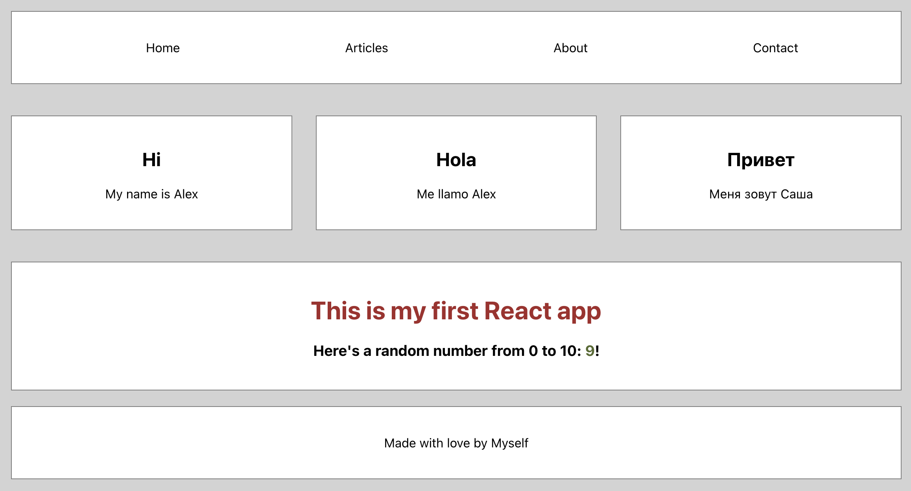

<h1>My First React App</h1>

## Table of Contents
- [Table of Contents](#table-of-contents)
- [Overview](#overview)
- [Demo](#demo)
- [Project Structure](#project-structure)
- [Technologies](#technologies)
- [Roadmap](#roadmap)
  - [Build in](#build-in)
  - [Learn about](#learn-about)
- [Installation](#installation)
  - [Prerequisites](#prerequisites)
  - [Steps](#steps)
- [Usage](#usage)
- [Acknowledgements](#acknowledgements)

## Overview

This project is a simple React application designed to help me learn the basics of React development. The application includes a navigation bar, footer, and card components, and covers a wide range of React concepts.

## Demo

~~Check out the live demo [here](https://example.com/demo).~~


*Figure 1: Screenshot of the main page as of June 18, 2024*


## Project Structure

```plaintext
my-app
├── public/                  # Static files accessible at the project root
│   ├── ...                  # Other files and directories
│   └── ...
├── src/                     # Source code of the application
│   ├── components/          # React components
│   │   ├── Footer.js        # Footer component
│   │   ├── Intro.js         # Intro component
│   │   ├── Nav.js           # Nav component
│   │   ├── Promo.js         # Promo component
│   │   └── ...              # Other components
│   ├── App.js               # Main application component
│   ├── index.js             # Application entry point
│   └── ...
├── package.json             # npm configuration file
├── package-lock.json        # npm dependencies lock file
├── readme-img/              # Images for README
│   ├── ...
│   └── ...
└── README.md                # Project documentation file

```

<!-- Features

    Responsive design
    State management with Context API
    Routing with React Router
    Data fetching with Axios -->

## Technologies
+ Reacts

## Roadmap

### Build in

- [x] Create React App
- [x] Components
  - [x] Nav
  - [x] Footer
  - [x] Cards
- [x] Styling
  - [x] Basic CSS
  - [x] CSS Modules
- [ ] etc...

### Learn about

- [ ] Components
  - [x] Functional Components
  - [ ] Class Components
- [ ] Props and State
  - [x] Passing Props
  - [ ] Managing State
- [ ] Lifecycle Methods
- [ ] Hooks
  - [ ] useState
  - [ ] useEffect
- [ ] Event Handling
- [ ] Conditional Rendering
- [ ] Lists and Keys
- [ ] Forms
- [ ] Styling Components
  - [ ] CSS Modules
  - [ ] Styled Components
- [ ] Routing
  - [ ] React Router
- [ ] State Management
  - [ ] Context API
  - [ ] \(Optional) Redux
- [ ] Fetching Data
  - [ ] Using Fetch API
  - [ ] Using Axios
- [ ] Testing
  - [ ] Jest
  - [ ] React Testing Library
- [ ] Build and Deployment


## Installation

### Prerequisites
> [!IMPORTANT]
> Node.js && npm

### Steps

1. Clone the repository:
    ```bash
    git clone https://github.com/your-username/my-first-react-app.git
    cd my-first-react-app
    ```

2. Install dependencies:
    ```bash
    npm install
    ```

## Usage

To start the development server, run:
```bash
npm start
```
The app will be available at http://localhost:3000.

## Acknowledgements

- [Coursera](https://www.coursera.org) for providing the opportunity to learn and grow.
- [Meta](https://www.coursera.org/learn/react-basics) for a great course on React Basics.
